
<!-- Visualizador online: https://stackedit.io/ -->
 

---

# Simulação da Propagação de COVID-19 em Ibirama

O objetivo desta [simulação com agentes](https://sites.google.com/view/simulacoescomagentes/) é estudar a propagação de COVID-19 na cidade de Ibirama/SC em diferentes cenários de isolamento social. A simulação considera dados  territoriais, populacionais, educacionais, e do mercado de trabalho **existentes** e **estimados**. Nesta simulação é criado um ***agente artificial (virtual)*** para cada habitante. Estes agentes reproduzem o comportamento diário dos habitantes de ir para o trabalho e/ou para instituição de ensino e então retornar para suas residências. Enquanto permanece no trabalho, escola, ou até mesmo em casa, um agente saudável pode ter contato com agente(s) infectado(s), ocasionando a propagação da doença. É possível simular o isolamento social **total** ou **setorial** (por exemplo, o isolamento apenas de estudantes ou trabalhadores) para verificar o efeito que estas medidas de isolamento podem causar na curva de contaminação do COVID-19.  

A simulação foi desenvolvida no âmbito do projeto de pesquisa [Desenvolvimento Dirigido a Modelos de Simulações com Agentes](https://www.udesc.br/ceavi/pesquisaepos/pesquisa/projetos) do [Centro de Educação Superior do Alto Vale do Itajaí (CEAVI/UDESC)](https://www.udesc.br/ceavi). Os autores da simulação são:

 - [**Lucas de Castro Lima Teixeira**](mailto:luukascastro@gmail.com) (aluno de Engenharia de Software e bolsista de pesquisa).
 - [**Fernando dos Santos**](mailto:fernando.santos@udesc.br) (professor no curso de Engenharia de Software).

A simulação foi desenvolvida na plataforma [NetLogo](https://ccl.northwestern.edu/netlogo/), e pode ser visualizada na Figura 1 abaixo (clique para abrir o video no YouTube).

>Figura 1: Video da Simulação de Propagação de COVID-19 em Ibirama/SC (clique para abrir no YouTube)

[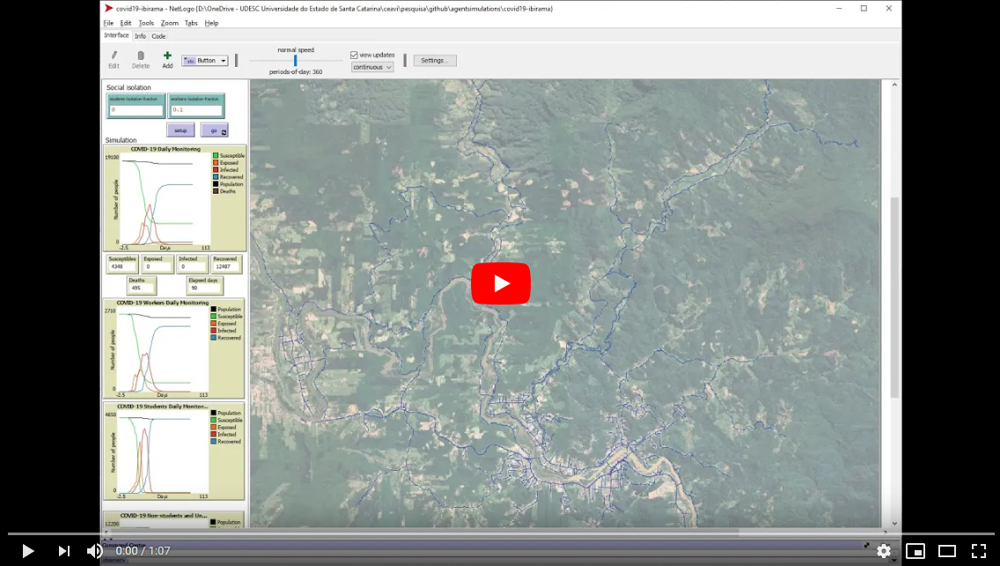](https://youtu.be/e7JUotej4XU)

Os dados utilizados na simulação são provenientes das seguintes fontes (apresentadas em detalhes mais abaixo):
- Os dados territoriais e viários foram obtidos do repositório [Open Street Map](https://www.openstreetmap.org/relation/296728).
- Os dados populacionais e domiciliares foram obtidos do [portal do IBGE](https://cidades.ibge.gov.br/brasil/sc/ibirama/panorama).
- Os dados educacionais foram obtidos do [portal do IBGE](https://cidades.ibge.gov.br/brasil/sc/ibirama/panorama) e também do portal [Educa Mais Brasil](https://www.educamaisbrasil.com.br/escolas/santa-catarina/ibirama).
- Os dados empresariais foram obtidos da [Federação Catarinense de Municípios (FECAM)](https://static.fecam.net.br/uploads/72/arquivos/1444231_Relatorio_Empresas_Ibirama.pdf).
- Os parâmetros da COVID-19 (ex: taxa de transmissão, duração, mortalidade) foram obtidos da literatura científica especializada.

É **muito importante** destacar que outros dados  **necessários** à simulação mas que **não estão disponíveis** nas fontes de dados acima (como por exemplo, a quantidade de funcionários de cada empresa ou de alunos em cada escola) foram **estimados**. Neste sentido, ressaltamos que a simulação **pode não refletir a dinâmica real de propagação de COVID-19 na cidade** e portanto seus resultados devem ser utilizados **com cautela**.  

# Sumário
* [Especificação da Simulação](#especificação-da-simulação)
	* [Territorial e Viária](#territorial-e-viária)
	* [População e Domicílios](#população-e-domicílios)
	* [Empresas e Trabalhadores](#empresas-e-trabalhadores)
	* [Instituções de Ensino e Alunos](#instituções-de-ensino-e-alunos)
	* [Comportamento dos Agentes](#comportamento-dos-agentes)
	* [Parâmetros da COVID-19](#parâmetros-da-covid-19)
* [Resultados Preliminares](#resultados-preliminares)
* [Próximos Passos](#próximos-passos)
* [Referências](#referências)

# Especificação da Simulação
## Territorial e Viária
Os dados territoriais e viários foram obtidos do repositório [Open Street Map](https://www.openstreetmap.org/relation/296728) em Março de 2020. A Figura 2 apresenta uma visualização do mapa utilizado. A estrutura viária está em vermelho. Os limites territoriais de Ibirama estão destacados em bege. Na simulação foi utilizado apenas a extensão territorial onde há ruas, destacada pelo retângulo azul. Essa extensão tem aproximadamente 21.44 km de altura por 14.36 km de largura.

>Figura 2: Mapa Territorial e Viário de Ibirama

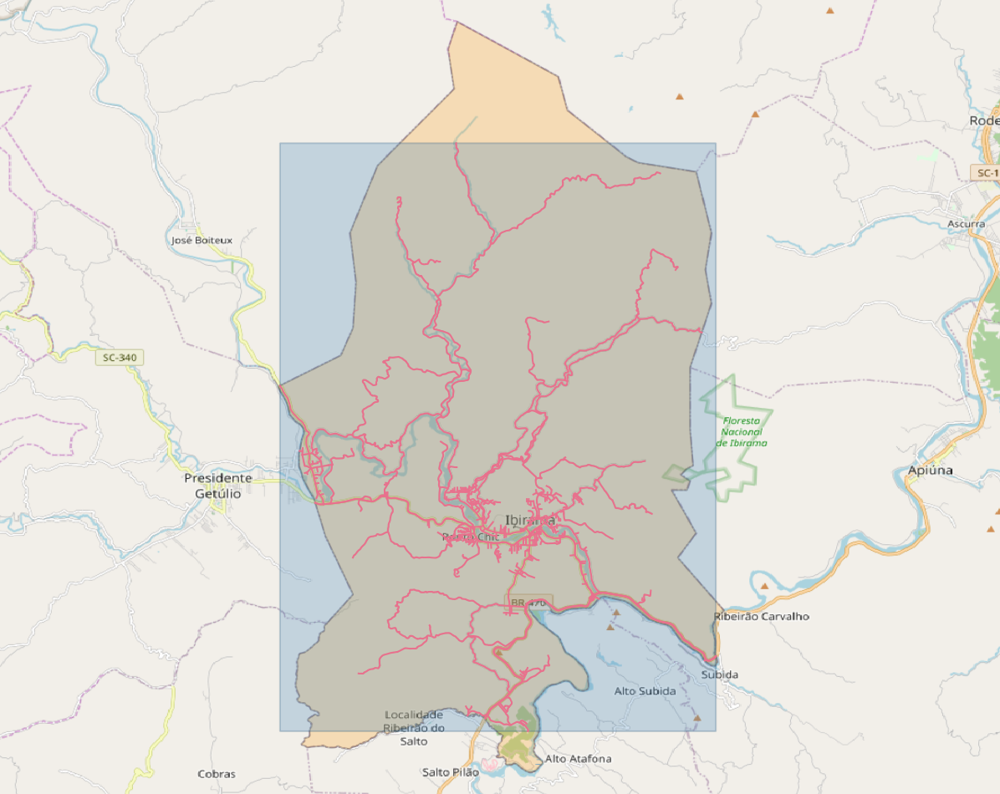

O NetLogo utiliza uma grade para representar o território por onde os agentes se movimentam (e onde estão localizadas as casas, escolas e empresas). Em nossa simulação definimos uma grade de acordo com a extensão territorial da cidade. A grade utilizada contém  2144 células de altura e 1436 células de largura, e portanto cada célula representa um retângulo de 10 x 10 metros do território de Ibirama.

## População e Domicílios

A simulação considera uma **população** de **17330** habitantes. Esta é a quantidade de *agentes artificiais* criados na simulação.

Este valor foi obtido através do Censo 2010 realizado pelo Instituto Brasileiro de Geografia e Estatística [(IBGE,  2010a)](#ibge-2010a). Dados populacionais referentes a 2019 estão disponíveis no portal do IBGE. Optamos não utilizar os dados de 2019 pois o IBGE não disponibiliza dados educacionais e domiciliares referentes a este ano, apenas referentes a 2010. Essa decisão visou manter coerência nas proporções de estudantes e domicílios em relação a população total.

Uma idade foi atribuída a cada *agente artificial*, de acordo com a pirâmide demográfica disponibilizada pelo IBGE [(IBGE,  2010a)](#ibge-2010a).

A simulação considera **5515 domicílios**, que são as moradias onde residem os habitantes (IBGE, 2010a). Para cada domicílio foi criada uma *casa virtual* posicionada na lateral de alguma rua da estrutura viária descrita anteriormente na seção [Especificação Territorial e Viária](#territorial-e-viária). Cada *agente virtual* habita uma *casa virtual*, e a quantidade de agentes por casa seguiu a distribuição abaixo [(IBGE, 2010a)](#ibge-2010a).

Quantidade de moradores | Quantidade de domicílios
------------: | -------------:
1 |	617
2 |	1457
3 |	1467
4 |	1094
5 |	530
6 |	213
7 |	81
8 |	34
9 |	8
10 | 	7
11 |	7
**Total**  | **5515**

Como não há dados disponiveis sobre a faixa etária dos habitantes de cada domicílio, a simulação faz uma distribuição aletatória. Ou seja, em um domicílio com 4 moradores pode haver dois jovens e duas crianças, ou pode haver dois jovens, uma criança, e um idoso. A simulação considera que menores de 16 anos não podem "morar sozinhos" (nossa decisão foi baseada no Art. 3º do [Código Civil Brasileiro](http://www.planalto.gov.br/ccivil_03/LEIS/2002/L10406.htm)). Portanto, nenhum domicílio é formada somente por pessoas menores de 16 anos. Ao menos uma pessoa do domicílio deve ser maior de 16 anos.

## Empresas e Trabalhadores

Os dados empresariais foram obtidos de um relatório emitido pela [Federação Catarinense de Municípios (FECAM)](https://static.fecam.net.br/uploads/72/arquivos/1444231_Relatorio_Empresas_Ibirama.pdf) em 21/03/2019. O relatório aponta a existência de **1418** CNPJs no município de Ibirama.

A localização geográfica destas empresas não está disponível no site da FECAM nem no site da Prefeitura de Ibirama. Por este motivo, realizamos um *levantamento manual* no Google Maps para encontrar as empresas. Procuramos pelo nome de cada empresa para verificar a existência de um ponto já cadastrado no Google Maps. Infelizmente, nem todas as empresas estão cadastradas no Google Maps. Apenas **282** das 1418 (19,89%) foram encontradas. Esta é a quantidade de empresas consideradas na simulação. Preparamos um [Google Map](https://www.google.com/maps/d/drive?state=%7B%22ids%22%3A%5B%221oSmpCIJzkWzKo-mdMAfmUI7tsTPptgT0%22%5D%2C%22action%22%3A%22open%22%2C%22userId%22%3A%22102580730194240009973%22%7D&usp=sharing) com a localização destas empresas.

Segundo o IBGE, Ibirama conta com 9142 habitantes trabalhadores [(IBGE,  2010c)](#ibge-2010c). Entretanto, não há dados disponiveis sobre a quantidade de trabalhadores **em cada empresa**. Portanto, solicitamos a um especialista da área contábil e com conhecimento das empresas de Ibirama - Professor [Sérgio Marian](https://www.udesc.br/professor/sergio.marian) (Departamento de Ciências Contábeis da UDESC Alto Vale) - que fizesse uma estimativa de quantos funcionários trabalham em cada uma das 282 empresas consideradas na simulação. A estimativa apontou **2462 trabalhadores**. Disponibilizamos a estimativa de trabalhadores por empresa neste [link](/data/empresas/README.md).

Portanto, a simulação considera apenas **282 empresas** (que foram encontradas no Google Maps) e apenas **2462 trabalhadores** (estimativa de especialista na área contábil). Os 6680 trabalhadores restantes foram tratados como agentes não economicamente ativos, cujo comportamento é detalhado posteriormente na seção  [Comportamento dos Agentes](#comportamento-dos-agentes).

***Ressaltamos que a adoção de quantidades de empresas e trabalhadores diferente das apontadas pela FECAM e IBGE pode fazer com que a simulação não reflita a dinâmica real de propagação de COVID-19 na cidade. Portanto, os resultados da simulação devem ser utilizados com cautela***

## Instituções de Ensino e Alunos

A simulação considera um total de **4487 alunos** [(IBGE,  2010b)](#ibge-2010b) que frequentam instituições de ensino no município de Ibirama.  O IBGE estratifica esta quantidade de alunos por categoria de ensino. A tabela a seguir apresenta a quantidade de alunos por categoria [(IBGE,  2010b)](#ibge-2010b) que foram considerados na simulação.

Categoria de ensino | Quantidade de alunos
------------ | -------------:
Educação Infantil |	449
Ensino Fundamental I |	1567
Ensino Fundamental II |	1078
Ensino Médio |	465
Ensino de Jovens e Adultos |	480
Universidades |	448
**Total** |	**4487**

A lista de instituições de ensino do município com e as respectivas faixas etárias das categorias de ensino foi obtida no portal [Educa Mais Brasil](https://www.educamaisbrasil.com.br/escolas/santa-catarina/ibirama). A tabela a seguir apresenta a quantidade de instituições de ensino consideradas na simulação. Preparamos um [Google Map](https://www.google.com/maps/d/drive?state=%7B%22ids%22%3A%5B%221isUELXN4khxv8gzN_x9ghP3ib6Ab9uSb%22%5D%2C%22action%22%3A%22open%22%2C%22userId%22%3A%22102580730194240009973%22%7D&usp=sharing) com a localização destas instituições.

Categoria de ensino | Quantidade de instituições | Faixa etária dos alunos
------------ | -------------: | -------------:
Educação Infantil | 12 | de 0 a 5 anos
Ensino Fundamental I | 9 | de 6 a 10 anos
Ensino Fundamental II |	5 | de 11 a 14 anos
Ensino Médio | 4 | de 15 a 17 anos
Ensino de Jovens e Adultos | 1 | acima de 15 anos
Universidades |	1 | acima de 18 anos

Como não há dados disponíveis sobre a quantidade de alunos em cada uma dessas instituiçoes de ensino, a simulação faz uma distribuição aleatória. Cada aluno é atribuído a uma escola aleatória que esta oferece as aulas para a sua faixa etária. Na categoria *Ensino de Jovens e Adultos* os agentes atribuídos devem ter idade maior ou igual a 15 anos para respeitar as normas da [Secretaria do Estado da Educação](http://sed.sc.gov.br/servicos/etapas-e-modalidades-de-ensino/29-modalidade-de-ensino/6617-educacao-de-jovens-e-adultos). A partir da idade dos agentes, eles são associados a uma escola.

## Comportamento dos Agentes
A simulação agrupa os habitantes de Ibirama em três categorias: (i) *estudantes*, (ii) *trabalhadores*, e (iii) *habitantes não economicamente ativos*. Para cada uma destas categorias foi criado um tipo de *agente artificial*. Ainda é possível haver uma combinação de categorias, por exemplo, para aqueles habitantes que *trabalham* e *estudam*. A seguir é detalhado o comportamento de cada categoria de agente.

### Agentes estudantes
Os **estudantes** são divididos em alunos do ensino *infantil*, *fundamental*, *médio*, *superior* (universitários) e de *educação de jovens e adultos*. Seu comportamento é organizado da seguinte forma:
- Movem-se para a instituição de  ensino no início do seu turno (matutino ou vespertino ou norturno).
- Na instituição de ensino, os agentes infectados transmitem a doença para outros agentes (uma única vez no turno).
- Voltam para casa ao fim do turno, ou caso sejam trabalhadores, se movem para o local de trabalho.
- Em casa, os agentes infectados transmitem a doença para outros agentes que moram no mesmo domicílio (uma única vez, até o início do próximo turno).

### Agentes trabalhadores
Os **agentes trabalhadores** se comportam da seguinte forma:
- Movem-se para a empresa no início do turno matutino.
- Na empresa, os agentes infectados transmitem a doença para outros agentes (uma única vez durante os dois turnos de trabalho).
- Voltam para casa ao fim do turno vespertino.
- Em casa, os agentes infectados transmitem a doença para outros agentes que moram no mesmo domicílio (uma única vez, até o início do próximo turno).

Caso o agente trabalhador também seja um estudante, então ele frequenta a empresa no contraturno escolar.

### Agentes não economicamente ativos
São aqueles agentes que **não trabalham nem estudam**. Estes agentes se comportam da seguinte forma:
- Permanecem em casa o tempo todo.
- Se forem infectados, então transmitem a doença em casa uma única vez no dia (ex.: durante a noite).

## Parâmetros da COVID-19

Para modelar a propagação da COVID-19 entre os *agentes artificiais*, adotamos o modelo epidemiológico compartimental SEIR [(Keeling e Rohani, 2011)](#keeling-e-rohani-2011). Ao aplicar este modelo epidemiológico em uma simulação com agentes, cada *agente artificial* é categorizado de acordo com seu *estado de saúde* em:

- **Suscetível** `(S)`: o agente não foi exposto à doença, ou seja, nunca foi infectado.
- **Exposto** `(E)`: o agente foi exposto à doença, e a doença está em período de incubação.
- **Infectado** `(I)`: o agente é considerado doente (após o período de incubação), podendo manifestar os sintomas, transmitir para outros agentes, e eventualmente falecer em função da doença.
- **Recuperado** `(R)`: o agente se recuperou da doença (está curado) e desenvolveu imunidade.

A dinâmica da doença ocorre com a transição do agente pelos estados `S -> E -> I -> R`. Essa transição é governada por parâmetros que caracterizam a doença, como por exemplo probabilidade de transmissão e mortalidade. A simulação adota os parâmetros da COVID-19 disponíveis na literatura científica especializada. Estes parâmetros e seus valores são apresentados a seguir.

#### Exposição, Infecção e Transmissão

Parâmetro | Valor | Referência
--- | ---: | :---:
Duração da Incubação (`E`) |	5 ou 6 dias |  [(ECDC, 2020)](#ecdc-2020)
Duração da Infecção (`I`)|	8 dias |  [(ECDC, 2020)](#ecdc-2020)
Probabilidade de transmissão |	0.3435 | [(SBI, 2020)](#sbi-2020)

A transmissão acontece quando um agente **infectado** `(I)` entra em contato com um agente **suscetível** `(S)`. Este contato ocorre nos locais onde o agente trabalha, estuda, ou reside, conforme descrito anteriormente na seção [Comportamento dos Agentes](#comportamento-dos-agentes). Se o agente for infectado, então ele passa para o estado **exposto** `(E)` e desenvolve a doença. Ao término do período **infectado** `(I)` o agente é considerado curado, desenvolvendo imunidade e passando para o estado **recuperado** `(R)`.

#### Mortalidade
A doença pode causar a morte do agente ao longo do período em que ele estiver **infectado** `(I)`. A taxa de mortalidade varia conforme a idade do agente. Nesta simulação adotamos as taxas de mortalidade por faixa etária observadas na China e reportadas na literatura [(NCPERET, 2020)](#ncperet-2020). A tabela a seguir apresenta as taxas de mortalidade utilizadas.

Faixa Etária |Taxa de Mortalidade
--- | ---:
≤ 9 anos  |	0.00%
10 a 19 anos | 0.18%
20 a 49 anos | 0.32%
50 a 59 anos |	1.30%
60 a 69 anos | 3.60%
70 a 79 anos | 8.00%
≥ 80 anos | 14.80%

# Resultados Preliminares
Realizamos algumas simulações para estudar a propagação em um período de 90 dias (3 meses). Cada simulação foi executada 10 vezes para que fosse possível obter resultados médios e assim mitigar os efeitos que a inicialização aleatória dos agentes poderia causar.

As simulações consideram que o *paciente zero* é **um único agente trabalhador**. Diferentes cenários de isolamento foram simulados, variando o percentual de estudantes e trabalhadores isolados. <!-- Essa parte da granularidade vamos deixar para falar só no futuro: Maiores granularidades nas taxas de isolamento foram escolhidas inicialmente para testar com objetividade a eficácia do isolamento social de um modo geral. -->

A Figura 3 apresenta a quantidade de agentes infectados no cenário onde o percentual de isolamento de estudantes e trabalhadores é o mesmo (por exemplo, isolando-se 75% de estudantes e 75% de trabalhadores, curva verde). Este gráfico evidencia a diferença na propagação em função do percentual de isolamento. O cenário que resulta na menor quantidade de infectados é aquele com isolamento total (100% de estudantes e 100% de trabalhadores). Neste cenário a quantidade de agentes infectados é próxima de zero (linha roxa que aparece junto ao eixo inferior). O cenário oposto é aquele onde não há isolamento nem de estudantes nem de trabalhadores, que resulta na maior quantidade de agentes infectados (linha azul).

>Figura 3: Simulação da propagação entre todos os habitantes considerando isolamento simultâneo de estudantes e trabalhadores (percentuais de isolamento com variação de 25%)

/Overall-infected/infected-chart(X,Y).png)

A Figura 4 apresenta a quantidade de agentes infectados no cenário em que considera somente o isolamento de estudantes.

>Figura 4: Simulação da propagação entre todos os habitantes considerando isolamento **apenas de estudantes** (percentuais de isolamento com variação de 25%)

/Overall-infected/infected-chart(X,00).png)

A Figura 5 apresenta a quantidade de agentes infectados no cenário em que considera somente o isolamento de trabalhadores.

>Figura 5: Simulação da propagação entre todos os habitantes considerando isolamento **apenas de trabalhadores** (percentuais de isolamento com variação de 25%)

/Overall-infected/infected-chart(00,Y).png)

Nos resultados mostrados nas Figuras 4 e 5 acima, nota-se semelhança nos casos em que houve isolamento de 25% ou 50% ou 75% de apenas uma classe de agentes. Por exemplo, isolar 25% dos trabalhadores e 0% de estudantes (Figura 5 linha vermelha) produz uma quantidade de infectados similar a isolar 25% dos estudantes e 0% de trabalhadores (Figura 4 linha vermelha). Isso dá **indícios de que é indiferente** isolar 25% ou 50% ou 75% de uma classe de agentes caso o percentual de isolamento da outra classe seja zero.

Por outro lado, os resultados mostram curvas acentuadamente diferentes ao isolar 100% de uma determinada classe. No caso do isolamento total de estudantes (Figura 4 linha roxa) há um achatamento maior da curva de infectados em comparação ao isolamento total de trabalhadores (Figura 5 linha roxa).  Possivelmente isso é devido a maior quantidade de estudantes existentes na simulação. Porém, ainda é necessário uma análise mais detalhada desta hipótese.

<!-- >No gráfico abaixo: propagação entre **todos os habitantes** com isolamento setorial (50% estudantes e 50% trabalhadores)

[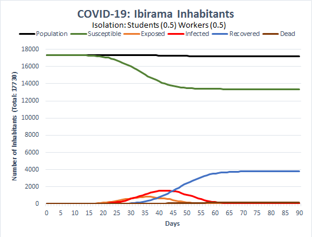](charts/introduction(1w)/isolation(0.5s_0.5w)/all-chart.png)

>No gráfico abaixo: propagação entre **todos os habitantes** com isolamento setorial (50% estudantes e 75% trabalhadores)

[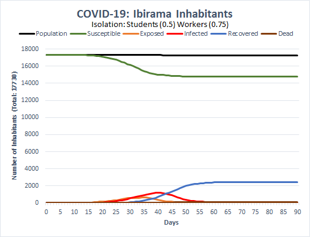](charts/introduction(1w)/isolation(0.5s_0.75w)/all-chart.png)

>No gráfico abaixo: propagação entre **todos os habitantes** com isolamento setorial (75% estudantes e 50% trabalhadores)

[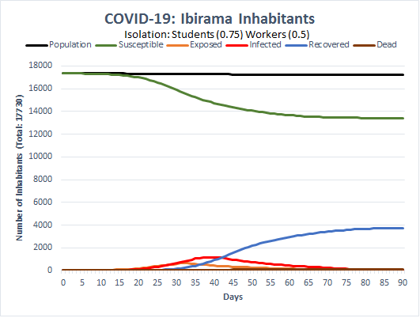](charts/introduction(1w)/isolation(0.75s_0.50w)/all-chart.png)

>No gráfico abaixo: propagação entre **todos os habitantes** com isolamento setorial (75% estudantes e 75% trabalhadores)

[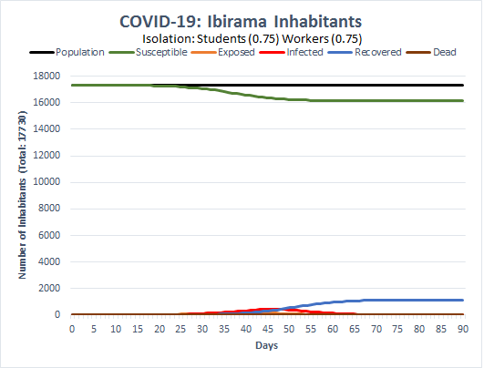](charts/introduction(1w)/isolation(0.75s_0.75w)/all-chart.png)

>No gráfico abaixo: propagação entre **todos os habitantes** com isolamento setorial (100% estudantes e 100% trabalhadores)

[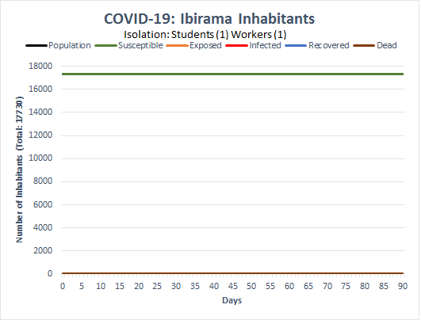](charts/introduction(1w)/isolation(1s_1w)/all-chart.png)

Algo que é possível inferir a partir da observação dos gráficos é a diminuição da quantidade de infectados conforme as taxas do isolamento de cada classe vai aumentando. O último gráfico apresenta uma média de 5 infectados e 0 mortes como resultado de um isolamento completo (100%).

>No gráfico abaixo: propagação entre **todos os habitantes** com isolamento setorial (0% estudantes e 10% trabalhadores)

[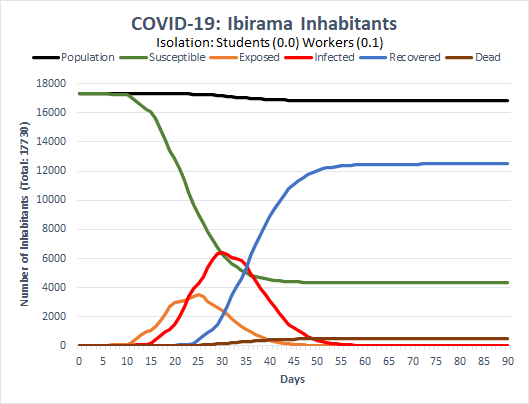](charts/introduction(1w)/isolation(0.0s_0.1w)/all-chart.png)

>No gráfico abaixo: propagação entre **estudantes** com isolamento setorial (0% estudantes e 10% trabalhadores)

[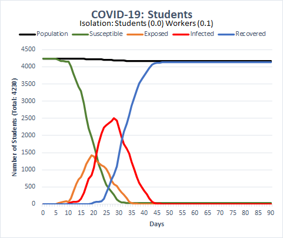](charts/introduction(1w)/isolation(0.0s_0.1w)/students-chart.png)

>No gráfico abaixo: propagação entre **trabalhadores** com isolamento setorial (0% estudantes e 10% trabalhadores)

[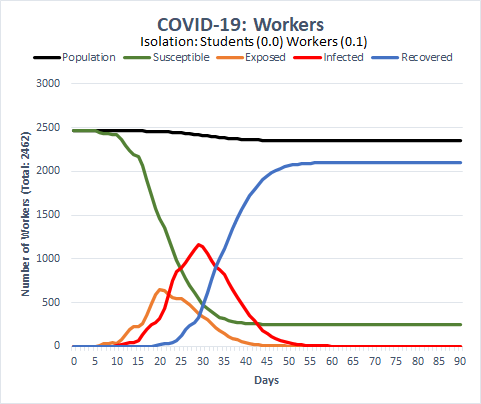](charts/introduction(1w)/isolation(0.0s_0.1w)/workers-chart.png)

>No gráfico abaixo: propagação entre **não estudantes e não trabalhadores** com isolamento setorial (0% estudantes e 10% trabalhadores)

[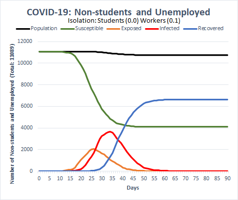](charts/introduction(1w)/isolation(0.0s_0.1w)/others-chart.png) -->

# Próximos Passos
Atualizaremos a simulação a medida que novos dados científicos sobre os parâmetros da COVID-19 específicos do Brasil e de Santa Catarina estejam disponíveis.

Nos próximos passos desta pesquisa pretendemos analisar os percentuais de infecções por classes de agente. Também pretendemos explorar cenários onde há mais de um *paciente zero*. Também pretendemos fazer análises mais detalhadas sobre a mortalidade dos agentes.

<!-- sugestoes: i) outras quantidades para "paciente zero" -->

# Referências
###### (ECDC, 2020)
European Centre for Disease Prevention and Control (ECDC). **Guidance for discharge and ending isolation in the context of widespread community transmission of COVID-19**. 2020. Disponível em < <https://www.ecdc.europa.eu/sites/default/files/documents/covid-19-guidance-discharge-and-ending-isolation-first%20update.pdf> >. Acesso em: 01 abr. 2020.

###### (IBGE, 2010a)
Instituto Brasileiro de Geografia e Estatística. **IBGE | Cidades@ | Santa Catarina | Ibirama | Pesquisa | Censo | Universo - Características da população e dos domicílios**. 2010a. Disponível em: < <https://cidades.ibge.gov.br/brasil/sc/ibirama/pesquisa/23/24304?detalhes=true> >. Acesso em: 01 abr. 2020.

###### (IBGE, 2010b)
Instituto Brasileiro de Geografia e Estatística. **IBGE | Cidades@ | Santa Catarina | Ibirama | Pesquisa | Censo | Amostra - Educação**. 2010b. Disponível em: < <https://cidades.ibge.gov.br/brasil/sc/ibirama/pesquisa/23/22469?detalhes=true> >. Acesso em: 01 abr. 2020.

###### (IBGE, 2010c)
Instituto Brasileiro de Geografia e Estatística. **IBGE | Cidades@ | Santa Catarina | Ibirama | Pesquisa | Censo | Amostra - Trabalho**. 2010b. Disponível em: < <https://cidades.ibge.gov.br/brasil/sc/ibirama/pesquisa/23/22957?detalhes=true> >. Acesso em: 01 abr. 2020.

###### (Keeling e Rohani, 2011)
KEELING, M. J.; ROHANI, P. **Modeling infectious diseases in humans and animals**. Princeton University Press, 2011.

###### (NCPERET, 2020)
The Novel Coronavirus Pneumonia Emergency Response Epidemiology Team (NCPERET). **The Epidemiological Characteristics of an Outbreak of 2019 Novel Coronavirus Diseases (COVID-19) — China**. China CDC Weekly, 2(8): 113-122. 2020. Disponível em: < <http://weekly.chinacdc.cn/en/article/id/e53946e2-c6c4-41e9-9a9b-fea8db1a8f51> >. Acesso em: 01 abr. 2020.

###### (SBI, 2020)
Sociedade Brasileira de Infectologia (SBI). **Informe da Sociedade Brasileira de Infectologia (SBI) sobre o novo coronavírus**. 2020. Disponível em < <https://www.infectologia.org.br/admin/zcloud/principal/2020/03/Informativo-CoV-12-03-2020.pdf> >. Acesso em: 01 abr. 2020.
