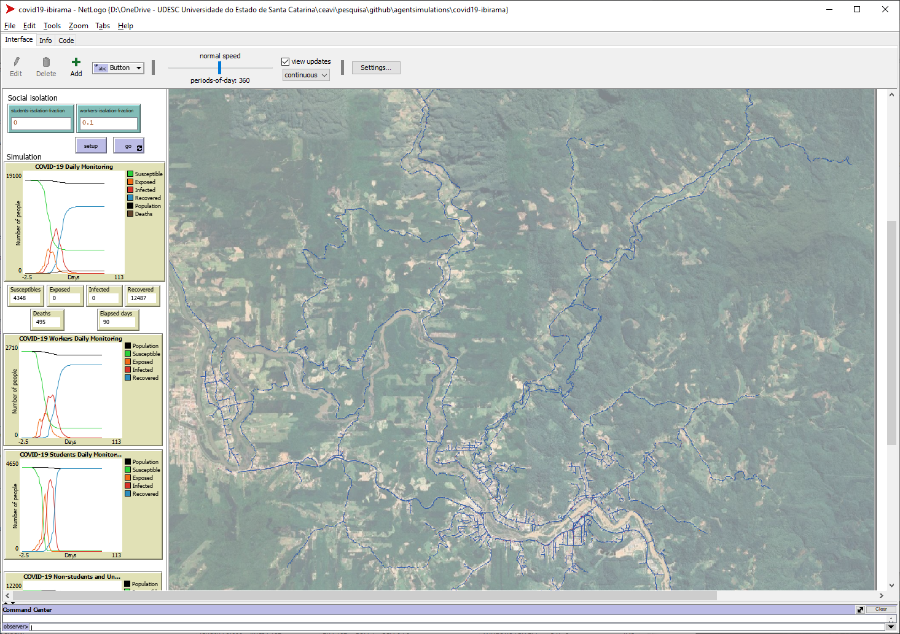

# Simulação da Propagação de COVID-19 em Ibirama

O objetivo desta [simulação com agentes](https://sites.google.com/view/simulacoescomagentes/) é estudar a propagação de COVID-19 na cidade de Ibirama/SC em diferentes cenários de isolamento social. Nesta simulação é criado um ***agente artificial (virtual)*** para cada habitante. Estes agentes reproduzem o comportamento diário dos habitantes de ir para o trabalho e/ou para instituição de ensino e então retornar para suas residências. Enquanto permanece no trabalho, escola, ou até mesmo em casa, um agente saudável pode ter contato com agente(s) infectado(s), ocasionando a propagação da doença. É possível simular o isolamento social **total** ou **setorial** (por exemplo, o isolamento apenas de estudantes ou trabalhadores) para verificar o efeito que estas medidas de isolamento podem causar na curva de contaminação do COVID-19.  
   
A simulação foi desenvolvida no âmbito do projeto de pesquisa [Desenvolvimento Dirigido a Modelos de Simulações com Agentes](https://www.udesc.br/ceavi/pesquisaepos/pesquisa/projetos) do [Centro de Educação Superior do Alto Vale do Itajaí (CEAVI/UDESC)](https://www.udesc.br/ceavi). Os autores da simulação são: 

 - [**Lucas de Castro Lima Teixeira**](mailto:email-do-lucas@dominio.com) (aluno de Engenharia de Software e bolsista de pesquisa).
 - [**Fernando dos Santos**](mailto:fernando.santos@udesc.br) (professor no curso de Engenharia de Software).

A simulação foi desenvolvida na plataforma [NetLogo](https://ccl.northwestern.edu/netlogo/), e pode ser visualizada na Figura 1. 

>Figura 1: Simulação de Propagação de COVID-19 em Ibirama/SC

Os dados utilizados na simulação são provenientes das seguintes fontes (apresentadas em detalhes mais abaixo):
- Os dados territoriais e viários foram obtidos do repositório [Open Street Map](https://www.openstreetmap.org/relation/296728). 
- Os dados populacionais e domiciliares foram obtidos do [portal do IBGE](https://cidades.ibge.gov.br/brasil/sc/ibirama/panorama). 
- Os dados educacionais foram obtidos do [portal do IBGE](https://cidades.ibge.gov.br/brasil/sc/ibirama/panorama) e também do portal [Educa Mais Brasil](https://www.educamaisbrasil.com.br/escolas/santa-catarina/ibirama).
- Os dados empresariais foram obtidos da [Federação Catarinense de Municípios (FECAM)](https://static.fecam.net.br/uploads/72/arquivos/1444231_Relatorio_Empresas_Ibirama.pdf).
- Os parâmetros da COVID-19 (ex: taxa de transmissão, duração, mortalidade) foram obtidos da literatura científica especializada.

É **muito importante** destacar que outros dados  **necessários** à simulação mas que **não estão disponíveis** nas fontes de dados acima (como por exemplo, a quantidade de funcionários de cada empresa ou de alunos em cada escola) foram **estimados**. Neste sentido, ressaltamos que a simulação **pode não refletir a dinâmica real de propagação de COVID-19 na cidade** e portanto seus resultados devem ser utilizados **com cautela**.  

# Sumário
* [Especificação da Simulação](#Especificação-da-Simulação)
	* [Territorial e Viária](#Territorial-e-Viária)
	* [População e Domicílios](#População-e-Domicílios)
	* [Empresas e Trabalhadores](#Empresas-e-Trabalhadores)
	* [Instituções de Ensino e Alunos](#Instituções-de-Ensino-e-Alunos)
	* [Comportamento dos Agentes](#Comportamento-dos-Agentes)
	* [Parâmetros da COVID-19](#Parâmetros-da-COVID-19)
* [Resultados Preliminares](#Resultados-Preliminares)
* [Referências](#Referências)

# Especificação da Simulação
### Territorial e Viária
### População e Domicílios
### Empresas e Trabalhadores
### Instituções de Ensino e Alunos
### Comportamento dos Agentes
### Parâmetros da COVID-19

# Resultados Preliminares

# Referências

